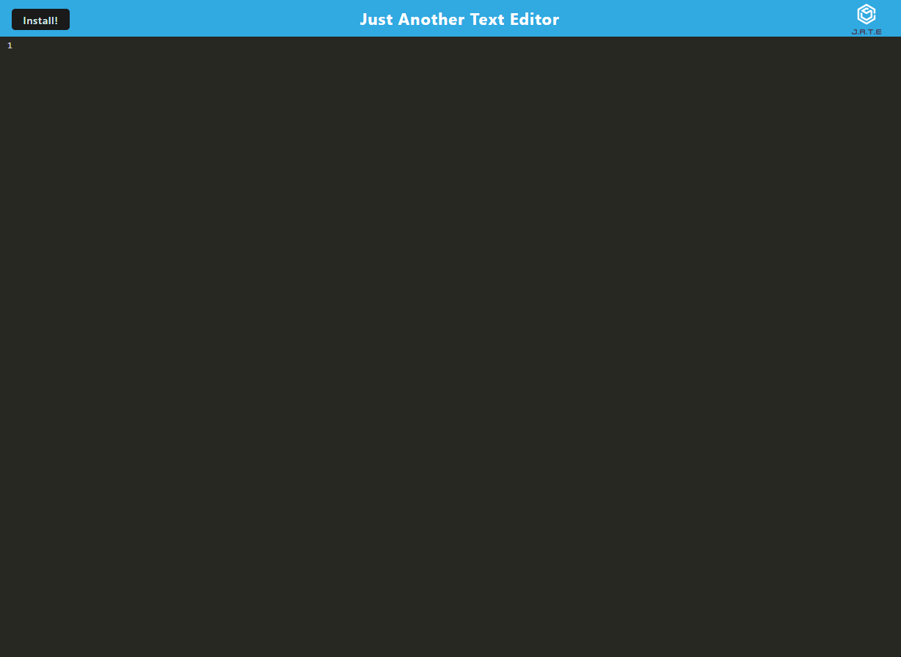

# Maximos-Text-Editor
A Text Editor Progressive Web Application (PWA) that utilizes idb, node, and heroku.


## TABLE OF CONTENTS

- [DESCRIPTION](#description)<br>
- [USER STORY](#user-story)<br>
- [INSTALLATION](#installation)<br>
- [TEST](#test)<br>
- [USAGE](#usage)<br>
- [LICENSE](#license)<br>
- [QUESTIONS](#questions)<br>
- [PHOTO](#photo)<br>
- [LIVE WEBSITE](#live-website)
  
## DESCRIPTION

A Text Editor Progressive Web Application (PWA) that utilizes idb, node, and heroku. This can also be downloaded as an application which can be used offline!

## USER STORY

AS A developer
I WANT to create notes or code snippets with or without an internet connection
SO THAT I can reliably retrieve them for later use

## INSTALLATION

Node.js is required
     
## TEST

1. Clone Repo and navigate to root folder of repo using a command-line interface (ex: git bash)
2. Type ``` npm i ``` to install dependencies needed to run this program.

## USAGE
    
Type ```node servver ``` while in the root directory of this application.

Test routes of this application using Insomnia.


## LICENSE
 
This application is covered under License ISC.<br>
[Click Here to View the License Statement](https://opensource.org/licenses/ISC)<br>

## QUESTIONS

For more applications, please refer to [my GitHub](https://github.com/maximtz13).<br>
For questions, please check usage documentation for reference.<br>
If your question is still unsolved, please send it to *maximtz99@gmail.com* and I will get back to you as soon as possible.

## PHOTO



## LIVE WEBSITE

